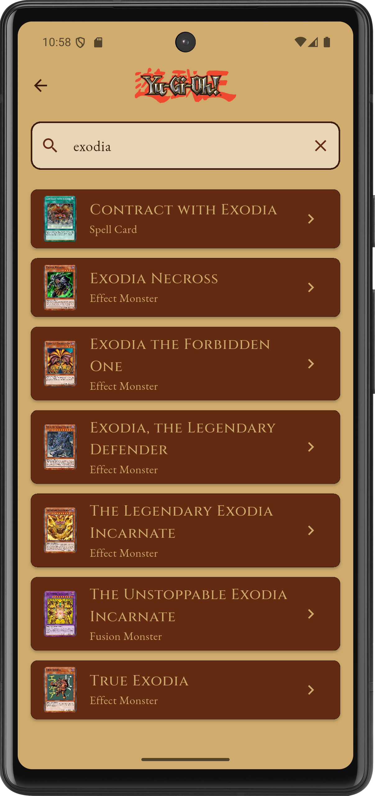
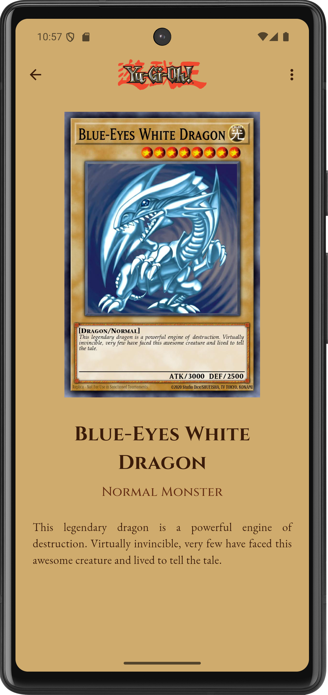
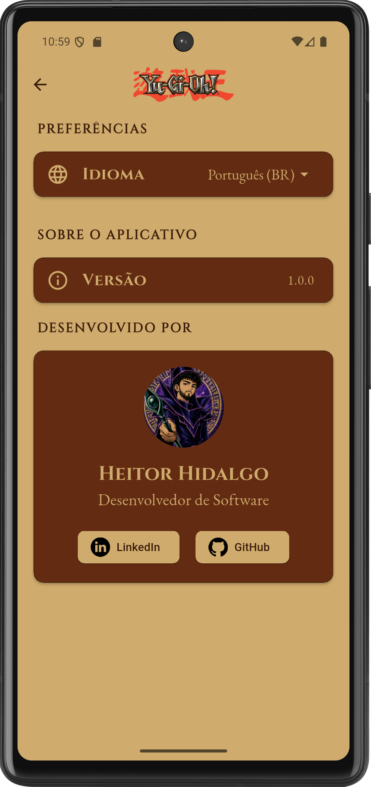
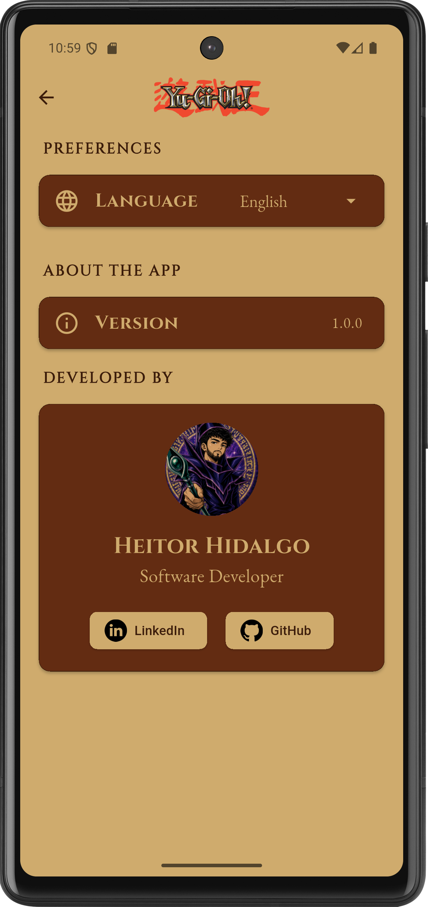

# 🎴 Yu-Gi-Oh! App

Aplicativo mobile desenvolvido em Flutter inspirado no universo de Yu-Gi-Oh!, permitindo pesquisar cartas oficiais através da API pública do YGOPRODeck, montar decks personalizados, visualizar personagens clássicos, aprender regras do jogo e explorar curiosidades da franquia.

Projeto desenvolvido com foco em boas práticas de Flutter, gerenciamento de estado com Riverpod, internacionalização e testes unitários.

---

# 📱 Demonstração

## Catálogo de Cartas



Pesquise cartas em tempo real utilizando a API oficial do YGOPRODeck.

---

## Detalhes da Carta



Visualização completa da carta selecionada com imagem em alta resolução, descrição detalhada e opção para adicionar ao deck.

---

## Configurações



Tela de configurações com suporte para múltiplos idiomas e informações do desenvolvedor.

---

## Internacionalização



O aplicativo possui suporte para:

* 🇧🇷 Português (Brasil)
* 🇺🇸 English (United States)
* 🇪🇸 Español (España)

---

#  Funcionalidades

## 🔍 Catálogo

* Busca de cartas através da API oficial do YGOPRODeck
* Pesquisa por nome
* Paginação infinita
* Loading states
* Tratamento de erros de conexão
* Cache de imagens

## 🎴 Meu Deck

* Adicionar cartas ao deck
* Remover cartas do deck
* Persistência local
* Limite de 60 cartas
* Limite de 3 cópias por carta
* Barra de progresso do deck

## 👤 Perfil

* Alteração de nome
* Alteração de email
* Seleção de avatar
* Persistência local de dados

## 🌎 Internacionalização

* Português
* Inglês
* Espanhol

## 📚 Conteúdo

* Personagens clássicos
* Curiosidades sobre a franquia
* Guia "Como Jogar"

## 🔐 Login

* Validação de email
* Validação de senha
* Persistência de sessão
* Opção "Manter conectado"

---

# 🛠 Tecnologias Utilizadas

## Framework

* Flutter
* Dart

## Gerenciamento de Estado

* Riverpod

## Internacionalização

* Easy Localization

## Persistência Local

* Shared Preferences

## Comunicação HTTP

* HTTP

## Imagens

* Cached Network Image

## Fontes

* Google Fonts

## Testes

* Flutter Test
* Mockito

---

# 🏗 Arquitetura Atual

O projeto atualmente utiliza uma arquitetura baseada em camadas:

```text
lib/
│
├── core/
│   ├── configs/
│   └── themes/
│
├── datasources/
│
├── models/
│
├── notifiers/
│
├── providers/
│
├── repositories/
│
├── routes/
│
├── views/
│
└── widgets/
```

Fluxo principal da aplicação:

```text
View
 ↓
Notifier
 ↓
Repository
 ↓
Datasource
 ↓
API
```

---

# 🌐 API Utilizada

O aplicativo consome dados da API pública do YGOPRODeck.

Documentação:

https://ygoprodeck.com/api-guide/

Endpoint principal:

```http
GET https://db.ygoprodeck.com/api/v7/cardinfo.php
```

---

# 📂 Estrutura do Projeto

```text
lib/
├── core/
├── datasources/
├── models/
├── notifiers/
├── providers/
├── repositories/
├── routes/
├── views/
└── widgets/
```

---

# 🧪 Testes

Atualmente o projeto possui testes unitários para:

## Models

* PerfilModel
* YugiohCardModel
* LoginState
* MeuDeckState
* CatalogoState

## Notifiers

* LoginNotifier
* MeuDeckNotifier
* PerfilNotifier
* CatalogoNotifier

Ferramentas utilizadas:

```yaml
flutter_test
mockito
```

Executar testes:

```bash
flutter test
```

Executar análise estática:

```bash
flutter analyze
```

---

# 🚀 Como Executar

## 1 - Clonar o projeto

```bash
git clone https://github.com/heitorhidalgo/flutter-nv2.git
```

## 2 - Entrar na pasta

```bash
cd flutter-nv2
```

## 3 - Instalar dependências

```bash
flutter pub get
```

## 4 - Executar

```bash
flutter run
```

---

# 📦 Dependências Principais

```yaml
flutter_riverpod
easy_localization
http
shared_preferences
cached_network_image
google_fonts
url_launcher
```

---

# 📌 Melhorias

Possíveis melhorias:

* [ ] Migração para Clean Architecture
* [ ] Injeção de dependências desacoplada
* [ ] Testes de Widget
* [ ] Testes de Integração
* [ ] Favoritos
* [ ] Filtros avançados
* [ ] Tema escuro
* [ ] Cache offline de catálogo
* [ ] CI/CD com GitHub Actions

---

# 👨‍💻 Desenvolvedor

## Heitor Hidalgo

Desenvolvedor Flutter.

### GitHub

https://github.com/heitorhidalgo

### LinkedIn

https://www.linkedin.com/in/heitorhidalgo/

---

# 📄 Licença

Projeto desenvolvido para fins educacionais e de portfólio.

Yu-Gi-Oh! é uma marca registrada da Konami. Este projeto não possui qualquer vínculo oficial com a franquia.
